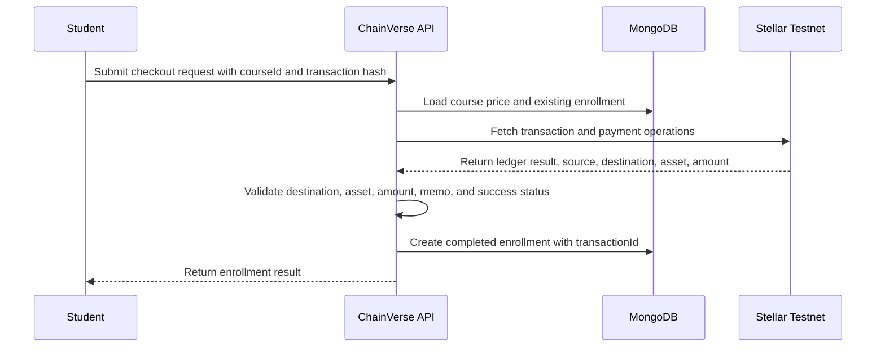
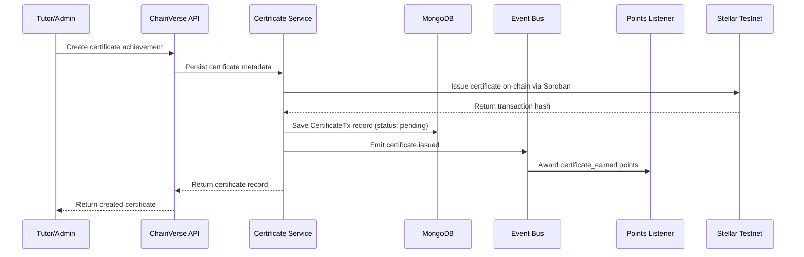

# Stellar Integration Flow

This guide documents how ChainVerse backend code should integrate with Stellar
for registration, payment verification, certificate issuance, and rewards.

## Current Integration Points

- `src/stellar/stellar.module.ts` exports `StellarService` for other modules.
- `src/stellar/stellar.service.ts` currently connects to Stellar Testnet through
  Horizon and exposes account lookup plus transaction submission helpers.
- `src/student-enrollment/student-enrollment.service.ts` records free course
  enrollment and leaves paid checkout behind an explicit `NotImplementedException`.
- `src/course-certification-nft-achievements/course-certification-nft-achievements.service.ts`
  emits `certificate.issued` after a certificate achievement is created.
- `src/events/listeners/points.listener.ts` awards internal points for enrollment
  and certificate events.

## Backend Stellar Account Setup

Use Stellar Testnet for local development and Wave validation.

1. Create a dedicated testnet account for the backend operator or treasury.
2. Fund it with Friendbot from the official Stellar laboratory or CLI.
3. Store only the public account ID in logs, docs, and non-secret config.
4. Keep secret keys outside git and outside request payloads. Use a secret
   manager or local `.env` only for development.
5. Rotate the testnet account before demos if a secret was exposed in any local
   log or shared screen.

The current `StellarService` hard-codes Horizon Testnet. If environment-based
network switching is added, keep `testnet` as the development default and require
an explicit production configuration before mainnet use.

## Environment Variables

The `.env.example` file contains Stellar-specific variables. When deploying to
production, ensure all contract addresses and the backend secret are set:

| Variable | Purpose | Required |
| --- | --- | --- |
| `STELLAR_NETWORK` | `testnet` or `public` | Yes |
| `STELLAR_HORIZON_URL` | Horizon endpoint, for example `https://horizon-testnet.stellar.org` | Yes |
| `STELLAR_RPC_URL` | Soroban RPC endpoint, for example `https://soroban-testnet.stellar.org` | Yes for contracts |
| `STELLAR_NETWORK_PASSPHRASE` | Network passphrase for transaction signing | Yes for contracts |
| `STELLAR_BACKEND_SECRET` | Secret key used only by backend-controlled signing flows | Yes (production) |
| `STELLAR_BACKEND_PUBLIC` | Public key for the backend Stellar account | Yes |
| `CONTRACT_CERTIFICATES` | Soroban contract ID for certificate minting | Yes (production) |
| `CONTRACT_REWARD` | Soroban contract ID for reward distribution | Yes (production) |
| `CONTRACT_ESCROW` | Soroban contract ID for payment escrow | Yes (production) |
| `CONTRACT_CHV_TOKEN` | Soroban contract ID for the CHV token | Yes (production) |
| `CONTRACT_COURSE_REGISTRY` | Soroban contract ID for course registry | Yes (production) |

Do not log `STELLAR_BACKEND_SECRET`, return it from health endpoints, or commit it
to `.env.example`.

## Payment Verification Flow



Minimum validation before marking a paid enrollment complete:

- The transaction exists on the configured Stellar network and succeeded.
- The payment destination is the configured treasury account.
- The asset code and issuer match the configured accepted asset.
- The amount is greater than or equal to the course price.
- The transaction hash has not already been used for another enrollment.
- The memo or operation metadata maps to the expected `studentId` and `courseId`.

## Certificate Issuance Sequence

The flow involves creating certificate metadata, issuing on-chain via Soroban,
recording the on-chain transaction for background sync, and emitting events.



### Background Sync (StellarSyncService)

After a certificate is issued on-chain, the `StellarSyncService` runs every 60
seconds (via `@Cron`) to poll Horizon and confirm the on-chain transaction:

1. Finds all `CertificateTx` records with status `pending`
2. Queries Horizon for the stored transaction hash
3. Updates status to `confirmed` when the ledger result is successful
4. Updates status to `failed` when the transaction did not succeed

This ensures the database stays in sync with the on-chain state without manual
intervention.

Today, certificate creation is represented in the backend service and event
pipeline. The `CertificateTx` record links the on-chain transaction to the
internal certificate ID for verifiable proof.

## Reward Distribution Flow

Current internal rewards:

- `student.enrolled` awards 10 points.
- `certificate.issued` awards 100 points.

Recommended Stellar-backed reward flow:

1. Award internal points from the existing event listeners.
2. Aggregate eligible rewards by `studentId`.
3. Resolve each student's verified Stellar destination account.
4. Build a testnet payment or Soroban contract call for the reward.
5. Submit through `StellarService`.
6. Store transaction hash, asset, amount, and status on the reward record.
7. Retry failed submissions idempotently by reward record ID.

Never distribute rewards from an unaudited admin request. Use a server-side
eligibility calculation based on enrollment and certificate events.

## Testnet Validation

Use unit tests for service behavior and integration tests only when network
access is expected.

```bash
# StellarService unit tests with mocked SDK behavior
npm test -- stellar.service.spec.ts

# Optional network-backed testnet smoke test
npm test -- stellar.integration.spec.ts
```

For a manual testnet verification:

1. Create or fund a Stellar Testnet account.
2. Submit a small payment to the configured treasury account.
3. Capture the transaction hash.
4. Call the checkout endpoint with the course ID and transaction hash once the
   payment verification endpoint exists.
5. Confirm the enrollment stores `transactionId` and emits
   `student.enrolled`.
6. Create a certificate achievement and confirm `certificate.issued` awards
   points.

Keep testnet transaction hashes in fixtures or docs only when they are public and
do not reveal private keys, seed phrases, or production account relationships.
